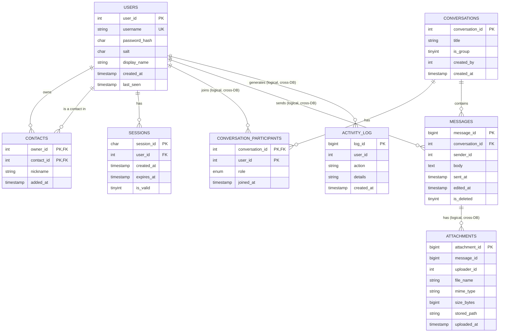

# PTEText — Database Schema

Three databases, all created by `sql/01_create_databases.sql`.

## ER diagram

Solid FK lines exist within one database; dashed "logical" references cross
database boundaries and are resolved by the service layer (see
[02-architecture.md](02-architecture.md)).

## Database 1 — `ptetext_users`

### `users`

| Column | Type | Notes |
|--------|------|-------|
| `user_id` | INT AUTO_INCREMENT | PK |
| `username` | VARCHAR(50) | UNIQUE, login name |
| `password_hash` | CHAR(64) | SHA-256 hex of `"salt:password"` |
| `salt` | CHAR(32) | 16 random bytes, hex |
| `display_name` | VARCHAR(100) | shown in chats |
| `created_at` | TIMESTAMP | default now |
| `last_seen` | TIMESTAMP NULL | updated on login |

### `contacts`

| Column | Type | Notes |
|--------|------|-------|
| `owner_id` | INT | PK part 1, FK -> users |
| `contact_id` | INT | PK part 2, FK -> users |
| `nickname` | VARCHAR(100) NULL | owner's private label |
| `added_at` | TIMESTAMP | |

### `sessions`

| Column | Type | Notes |
|--------|------|-------|
| `session_id` | CHAR(36) | PK, UUID |
| `user_id` | INT | FK -> users |
| `created_at` | TIMESTAMP | |
| `expires_at` | TIMESTAMP | created_at + 12 h |
| `is_valid` | TINYINT(1) | 0 after logout |

## Database 2 — `ptetext_chat`

### `conversations`

| Column | Type | Notes |
|--------|------|-------|
| `conversation_id` | INT AUTO_INCREMENT | PK |
| `title` | VARCHAR(100) NULL | NULL = direct message |
| `is_group` | TINYINT(1) | |
| `created_by` | INT | logical ref -> users.user_id |
| `created_at` | TIMESTAMP | |

### `conversation_participants`

| Column | Type | Notes |
|--------|------|-------|
| `conversation_id` | INT | PK part 1, FK -> conversations |
| `user_id` | INT | PK part 2, logical ref -> users |
| `role` | ENUM('member','admin') | creator is admin |
| `joined_at` | TIMESTAMP | |

### `messages`

| Column | Type | Notes |
|--------|------|-------|
| `message_id` | BIGINT AUTO_INCREMENT | PK |
| `conversation_id` | INT | FK -> conversations |
| `sender_id` | INT | logical ref -> users.user_id |
| `body` | TEXT | |
| `sent_at` | TIMESTAMP | |
| `edited_at` | TIMESTAMP NULL | future: edit feature |
| `is_deleted` | TINYINT(1) | soft delete |

Index: `(conversation_id, sent_at)` for fast "latest N messages" reads.

## Database 3 — `ptetext_system`

### `activity_log`

| Column | Type | Notes |
|--------|------|-------|
| `log_id` | BIGINT AUTO_INCREMENT | PK |
| `user_id` | INT NULL | NULL for anonymous events (e.g. failed login) |
| `action` | VARCHAR(50) | `REGISTER`, `LOGIN`, `LOGIN_FAILED`, `LOGOUT`, `MESSAGE_SENT`, `GROUP_CREATED`, `CONTACT_ADDED`, `ATTACHMENT_ADDED` |
| `details` | VARCHAR(255) NULL | free-text context |
| `created_at` | TIMESTAMP | |

### `attachments`

| Column | Type | Notes |
|--------|------|-------|
| `attachment_id` | BIGINT AUTO_INCREMENT | PK |
| `message_id` | BIGINT | logical ref -> messages.message_id |
| `uploader_id` | INT | logical ref -> users.user_id |
| `file_name` | VARCHAR(255) | |
| `mime_type` | VARCHAR(100) | |
| `size_bytes` | BIGINT | |
| `stored_path` | VARCHAR(500) NULL | reserved for real file storage |
| `uploaded_at` | TIMESTAMP | |

## Design notes

- **`users` PK is `INT`, `messages` PK is `BIGINT`** — a chat accumulates far
  more rows than there will ever be users.
- **Soft delete** (`is_deleted`) keeps audit history intact.
- **Composite PKs** on `contacts` and `conversation_participants` prevent
  duplicate rows at the database level.
- **utf8mb4** everywhere so emoji and non-Latin text work.
