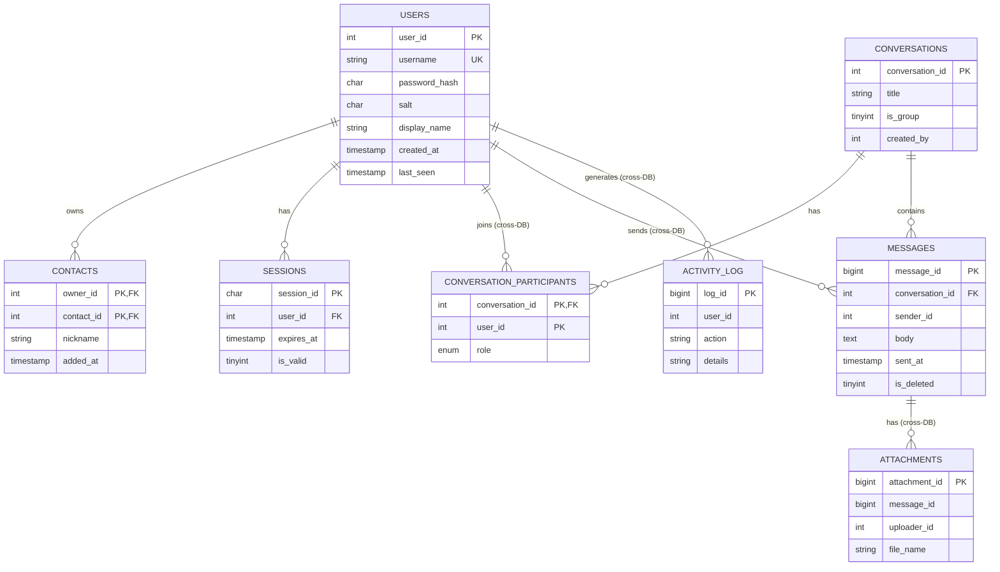

# Database Schema — every table, explained

Three databases, created by `sql/01_create_databases.sql`.

Quick vocab for anyone new to databases:

- **PK** (primary key) = the column that uniquely identifies each row
- **FK** (foreign key) = a column that points at another table's PK
- **"logical ref"** below = it *points at* a table in a different database,
  so it's not a real FK — the Java code does the lookup instead

## The picture

## Database 1 — `ptetext_users` (who you are)

### `users` — the accounts

| Column | What it holds |
|--------|---------------|
| `user_id` | auto-increment PK — 1, 2, 3... |
| `username` | login name, must be unique (`alice`, `bob`...) |
| `password_hash` | the scrambled password (SHA-256 hex, 64 chars) |
| `salt` | random value mixed into the hash so two identical passwords look different |
| `display_name` | the pretty name shown in chats ("Alice Anderson") |
| `created_at` | when the account was made |
| `last_seen` | last login time |

### `contacts` — your friends list

| Column | What it holds |
|--------|---------------|
| `owner_id` | whose list this is (FK -> users) |
| `contact_id` | who's in the list (FK -> users) |
| `nickname` | optional private label ("Bobby") |
| `added_at` | when added |

PK is `owner_id + contact_id` together, so you can't add the same person twice.

### `sessions` — who's logged in

| Column | What it holds |
|--------|---------------|
| `session_id` | a UUID token |
| `user_id` | FK -> users |
| `expires_at` | sessions die after 12 hours |
| `is_valid` | set to 0 on logout |

## Database 2 — `ptetext_chat` (the talking)

### `conversations` — the chats

| Column | What it holds |
|--------|---------------|
| `conversation_id` | auto-increment PK |
| `title` | group name; **NULL = it's a DM** between two people |
| `is_group` | 1 = group chat, 0 = DM |
| `created_by` | user_id of the creator (logical ref) |

### `conversation_participants` — who's in each chat

| Column | What it holds |
|--------|---------------|
| `conversation_id` | FK -> conversations |
| `user_id` | which user (logical ref -> users) |
| `role` | `member` or `admin` (creator is admin) |
| `joined_at` | when they joined |

### `messages` — the texts

| Column | What it holds |
|--------|---------------|
| `message_id` | BIGINT auto-increment PK — messages pile up fast, hence the bigger type |
| `conversation_id` | FK -> conversations |
| `sender_id` | who sent it (logical ref -> users) |
| `body` | the text |
| `sent_at` | timestamp |
| `edited_at` | for a future edit feature |
| `is_deleted` | soft delete — the row stays, it just stops showing |

## Database 3 — `ptetext_system` (the receipts)

### `activity_log` — who did what, when

| Column | What it holds |
|--------|---------------|
| `log_id` | auto-increment PK |
| `user_id` | who did it; NULL = nobody/system (e.g. failed login) |
| `action` | one of: `REGISTER`, `LOGIN`, `LOGIN_FAILED`, `LOGOUT`, `MESSAGE_SENT`, `GROUP_CREATED`, `CONTACT_ADDED`, `ATTACHMENT_ADDED` |
| `details` | extra context, free text |
| `created_at` | timestamp |

### `attachments` — file info (not the files themselves)

| Column | What it holds |
|--------|---------------|
| `attachment_id` | auto-increment PK |
| `message_id` | which message carries the file (logical ref) |
| `uploader_id` | who sent it (logical ref) |
| `file_name` | e.g. `homework.pdf` |
| `mime_type` | e.g. `application/pdf` |
| `size_bytes` | file size |
| `stored_path` | empty for now — real file storage is an open issue |

## Design choices worth mentioning

- **`is_deleted` instead of real DELETE** — messages are soft-deleted so the
  history/audit stays complete.
- **Composite PKs** (`owner_id + contact_id`, `conversation_id + user_id`)
  make duplicates impossible at the database level.
- **utf8mb4 charset** — emoji and non-English text work everywhere.
